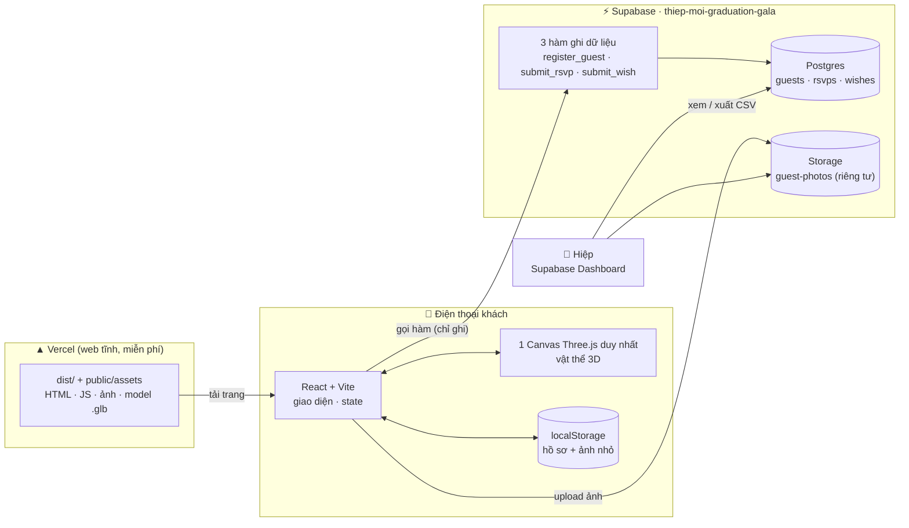
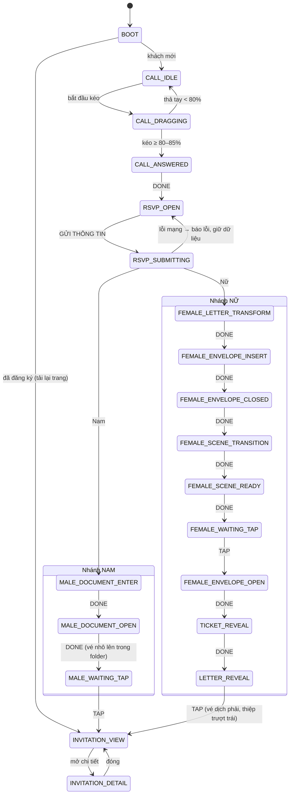
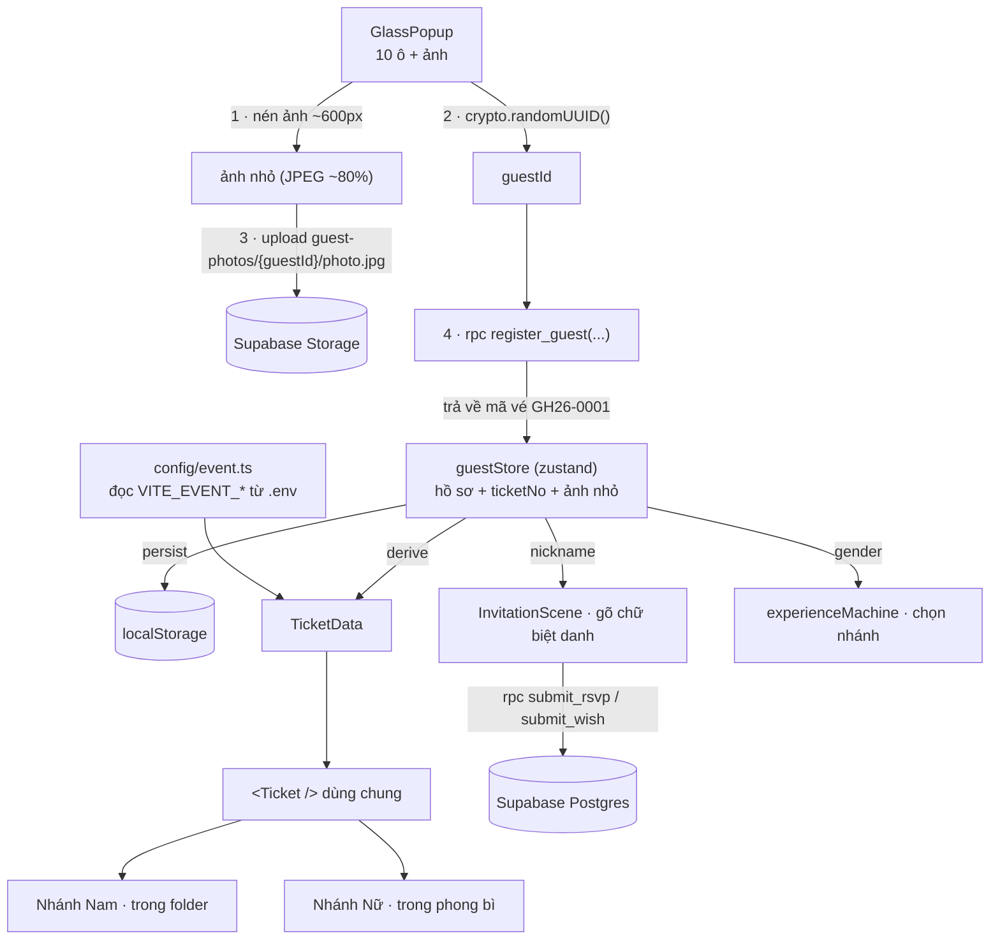
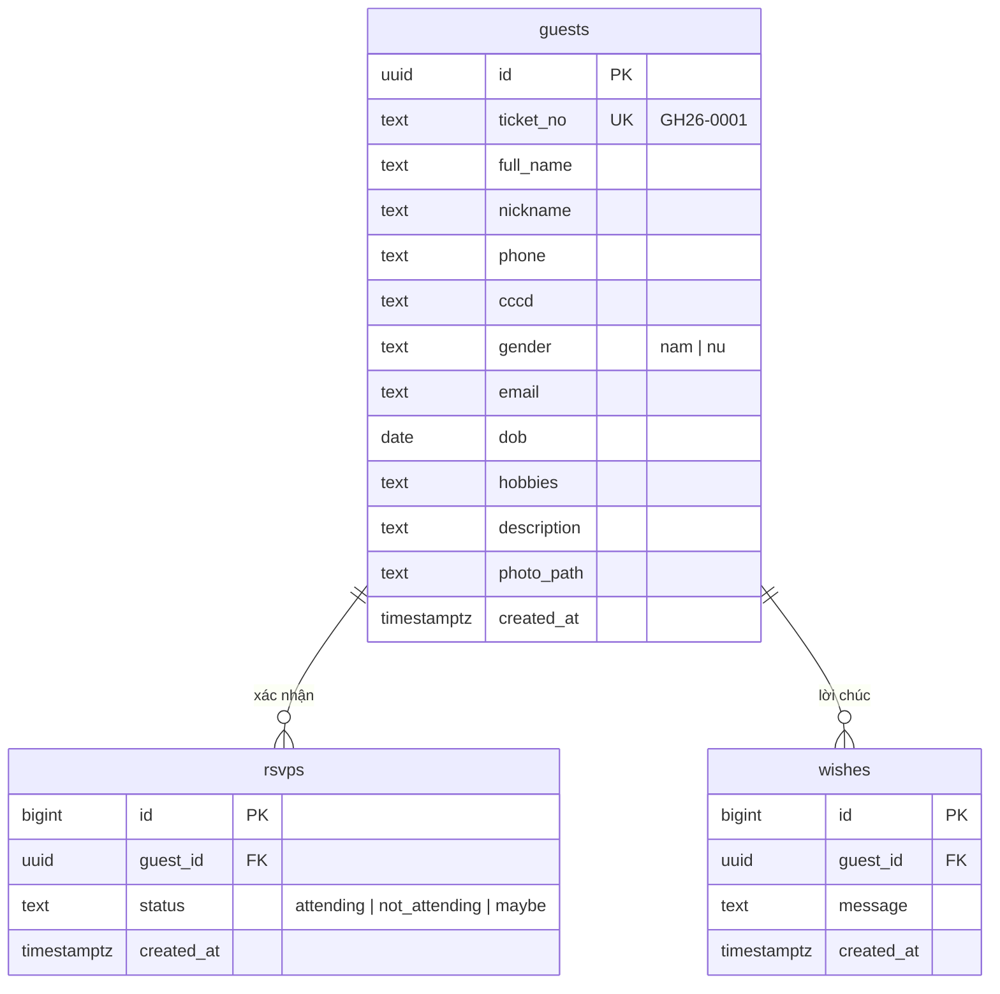
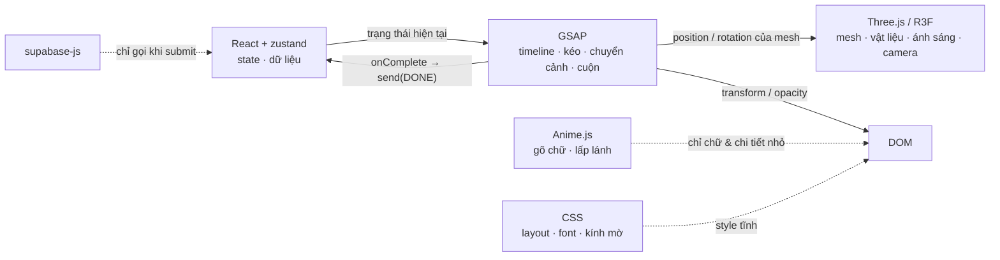
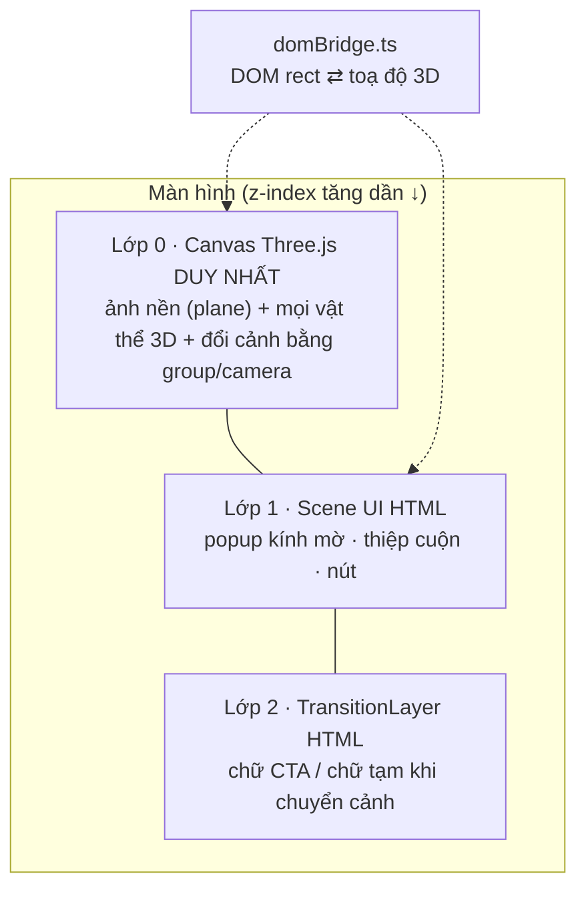
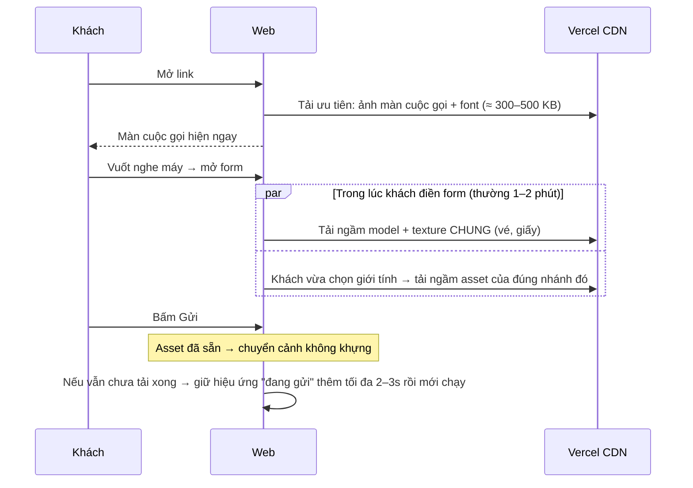
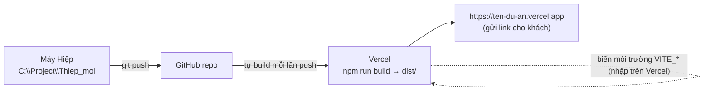

# Kiến trúc dự án: Thiệp mời Graduation Gala 2026

> Bản 2, ngày 24/09/2026. Bản này bỏ Node/Express, chuyển sang Supabase + Vercel và vá 5 điểm yếu của bản 1.
> Sơ đồ viết bằng Mermaid, xem được trên GitHub hoặc trong VS Code (cần extension "Markdown Preview Mermaid Support").

**Mục tiêu vận hành:** dự án chỉ dùng cho một dịp duy nhất. Vì vậy chọn cách đơn giản nhất có thể:

- Không có server riêng.
- Deploy một web tĩnh lên Vercel.
- Dữ liệu khách lưu trên Supabase.
- Xong sự kiện thì xoá cả project cho sạch.

---

## 1. Tổng quan hệ thống



**Bảo mật dữ liệu khách** (SĐT, CCCD, ảnh):

- Khoá dùng ở web là khoá *publishable*, được phép công khai.
- Khách chỉ **ghi** được qua 3 hàm. Khách **không đọc** được bảng nào, kể cả dữ liệu của chính mình. Các bảng đều bật RLS và không có policy đọc.
- Ảnh chỉ upload được, không xem được từ web.
- Chỉ Hiệp xem dữ liệu, qua Supabase Dashboard: Table Editor → `guest_overview`.
- Vé hiển thị ảnh từ bản sao đã nén lưu ngay trên máy khách, nên không cần đọc ngược lên server.

---

## 2. Hành trình khách mời (state machine)

State machine nằm trong `src/state/experienceMachine.ts`. Có hai sự kiện chuyển trạng thái chính:

- `DONE`: timeline GSAP của bước đó chạy xong (gọi trong `onComplete`).
- `TAP`: khách chạm vào vật thể.



### Quy tắc chống lỗi (vá điểm yếu số 3)

| Tình huống | Cách xử lý |
|---|---|
| Khách tải lại trang giữa chừng | Trạng thái `BOOT` đọc localStorage. Nếu khách đã có mã vé thì vào thẳng `INVITATION_VIEW`. Nếu chưa gửi form thì quay về màn cuộc gọi, form vẫn giữ những gì đã điền. |
| Khách chạm liên tục khi hiệu ứng đang chạy | Mỗi trạng thái chỉ nhận đúng sự kiện của nó. Ví dụ `TAP` chỉ có tác dụng ở `*_WAITING_TAP`. Các sự kiện không hợp lệ bị bỏ qua. |
| Khách bấm Gửi 2 lần | Hàm `register_guest` nhận `id` do máy khách tạo sẵn. Gửi lại cùng `id` thì nhận lại mã vé cũ, không tạo vé mới. |
| Mất mạng lúc gửi | Ở lại `RSVP_OPEN`, báo lỗi và giữ nguyên dữ liệu. Không chạy hiệu ứng khi dữ liệu chưa lưu xong. |
| Máy yếu, hoặc bật "Giảm chuyển động" | Dùng timeline rút gọn: vẫn giữ đúng thứ tự vật thể, nhưng ngắn hơn, bỏ parallax và bỏ bóng đổ động. |

---

## 3. Luồng dữ liệu khách



**Mã vé** do database cấp theo thứ tự (`GH26-0001`, `GH26-0002`...), nên không bao giờ trùng giữa hai khách.

### Cơ sở dữ liệu

Toàn bộ nằm trong `supabase/schema.sql` và đã được áp dụng.



---

## 4. Phân vai thư viện (mỗi thuộc tính chỉ một "chủ")



| Thứ cần điều khiển | Chủ sở hữu | Không được |
|---|---|---|
| Vị trí, xoay, scale của vật thể | GSAP | Dùng CSS transition hoặc Anime.js trên cùng thuộc tính |
| Vật liệu, ánh sáng, bóng đổ 3D | Three.js / R3F | Dùng React `setState` ở mỗi khung hình |
| Gõ chữ biệt danh, chữ hiện dần, lấp lánh | Anime.js | Điều khiển timeline chính |
| Bố cục, font, style tĩnh | CSS | Viết chuỗi chuyển cảnh bằng keyframes |
| Đang ở bước nào, dữ liệu khách | React (zustand) | Chạy animation từng frame |

---

## 5. Một canvas + cầu nối DOM ↔ 3D (vá điểm yếu số 1)

Bản 1 đặt `TransitionLayer` là một lớp HTML riêng. Cách này không dùng được, vì phong bì, folder và vé là vật thể 3D sống trong WebGL, không thể "nhấc" chúng lên một lớp HTML.

Bản 2 xử lý như sau:

- **Chỉ có 1 `<Canvas>`** phủ toàn màn hình, được tạo 1 lần duy nhất trong `ExperienceCanvas` và không bao giờ unmount. Làm vậy để tránh lỗi "WebGL Context Lost" từng gặp ở bản cũ.
- **Mỗi cảnh là một nhóm (`<group>`) trong cùng canvas.** Chuyển cảnh nghĩa là GSAP di chuyển group, hoặc camera. Không có chuyện huỷ canvas rồi tạo lại.
- **Cầu nối DOM ↔ 3D** nằm ở `src/three/domBridge.ts`:
  - Đọc `getBoundingClientRect()` của một phần tử HTML (popup, hoặc anchor `#ticket-target`), đổi sang toạ độ và kích thước trong thế giới 3D ở một độ sâu cho trước.
  - Dùng khi popup (HTML) biến thành lá thư (3D): lá thư xuất hiện đúng kích thước và vị trí của popup, rồi GSAP cho nó bay đi.
  - Chạy ngược lại khi cần đặt chữ HTML khớp lên trên vật thể 3D.
- `TransitionLayer` (HTML) giờ chỉ còn giữ **chữ và nút** tạm thời trong lúc chuyển cảnh, ví dụ dòng CTA "CHẠM VÀO THƯ ĐỂ MỞ".



---

## 6. Tải trước asset (vá điểm yếu số 2)



- Dùng `useGLTF.preload()` và `useTexture.preload()` của drei, gọi trong `src/three/preload.ts` theo từng giai đoạn.
- Khách **chỉ tải asset của nhánh mình**. Khách Nam không tải cảnh tulip, nên đỡ tốn dung lượng cho cả hai nhánh.

---

## 7. Ngân sách hiệu năng điện thoại (vá điểm yếu số 4)

| Hạng mục | Quy định |
|---|---|
| Tổng dung lượng mỗi nhánh | ≤ 8 MB (lần đầu), ảnh nền ≤ 400 KB/ảnh |
| Model `.glb` | Nén **Meshopt** hoặc **Draco**, ≤ 50k tam giác cho mỗi cảnh |
| Texture | ≤ 2048 px. Dùng **KTX2** (nén trên GPU) khi có thể, nếu không thì WebP |
| Bóng đổ | Dùng bóng "nướng" sẵn vào texture, cộng `ContactShadows` của drei. **Không** bật shadow map thời gian thực cho quá 1 đèn |
| Độ phân giải canvas | `dpr={[1, 2]}`, tự hạ xuống khi FPS thấp (`PerformanceMonitor` của drei) |
| Vòng vẽ | `frameloop="demand"`: canvas chỉ vẽ khi có chuyển động. Cảnh đứng yên thì GPU nghỉ, máy đỡ nóng |
| Chế độ `low` | Bỏ parallax và cánh hoa bay, giảm số đèn, dùng ảnh 2.5D thay model nặng |

---

## 8. Deploy: Vercel (vá điểm yếu số 5)



1. Đẩy code lên GitHub.
2. Trên vercel.com chọn *Add New Project*, chọn repo. Vercel tự nhận ra Vite.
3. Vào *Settings → Environment Variables*, nhập các biến giống `.env.local`.
4. Mỗi lần push, Vercel tự build lại. `vercel.json` đã cấu hình sẵn cache cho asset và rewrite để tải lại trang không bị lỗi 404.

**Sau sự kiện:**

1. Xuất CSV khách, RSVP và lời chúc từ Supabase nếu muốn giữ lại.
2. Xoá project Supabase để dữ liệu cá nhân của khách không còn nằm trên mạng.
3. Tắt hoặc xoá project Vercel.

---

## 9. Cây thư mục

```
Thiep_moi/
├── index.html                 # khung HTML, font Google (Cormorant, Great Vibes, Inter)
├── vite.config.ts             # alias @ → src, tách chunk three/motion
├── vercel.json                # cấu hình deploy Vercel
├── .env.example               # Supabase + thông tin sự kiện (copy → .env.local)
├── docs/ARCHITECTURE.md       # tài liệu này
├── supabase/schema.sql        # bảng + hàm + bucket ảnh (đã áp dụng)
├── public/assets/
│   ├── backgrounds/           # call-scene.webp, female-flower-scene.webp, male-document-scene.webp
│   ├── male/                  # folder-front/back, invitation, airplane-ticket
│   ├── female/                # envelope-front/back/flap, letter, bouquet
│   ├── tickets/               # texture giấy vé, hoạ tiết
│   ├── documents/             # giấy thư mời, 3 tấm Z-fold
│   ├── flowers/               # tulip, cánh hoa rời
│   ├── models/                # *.glb đã nén
│   ├── textures/              # vân giấy, marble, vải
│   └── fonts/                 # font thư pháp tiếng Việt .woff2 (nếu có)
└── src/
    ├── app/                   # App.tsx (gắn Canvas + UI), routes.tsx
    ├── config/                # event.ts: đọc VITE_EVENT_*
    ├── api/                   # supabase.ts (client), guests.ts, rsvp.ts, wishes.ts
    ├── lib/                   # gsap.ts: đăng ký Draggable, MotionPath, ScrollTrigger
    ├── state/                 # experienceMachine.ts, guestStore.ts
    ├── hooks/                 # useSwipeAnswer, useGuestData, useResponsive, useReducedMotion, useQuality
    ├── utils/                 # geometry, animation, localStorage, device, image (nén ảnh)
    ├── styles/                # tokens.css, global.css
    ├── components/            # CallScreen, SlideToAnswer, GlassPopup, Ticket, DocumentFolder,
    │                          # Letter, Envelope, ZFoldInvitation, Bouquet, TransitionLayer
    ├── scenes/                # CallScene, RSVPScene, MaleScene, FemaleScene, InvitationScene
    ├── animations/
    │   ├── gsap/              # callTimeline, popupTimeline, maleDocumentTimeline, femaleLetterTimeline,
    │   │                      # femaleEnvelopeTimeline, femaleSceneTransition, invitationTimeline, scrollTimeline
    │   └── anime/             # typewriter, textReveal, microInteractions
    └── three/                 # ExperienceCanvas, CameraRig, Lighting, Environment,
                               # domBridge.ts, preload.ts, models/
```

---

## 10. Thứ tự làm

Phase 13 cũ (Node API) đã được thay bằng Supabase, và database đã xong.

```mermaid
flowchart LR
  P1["1 Setup ✅"] --> P2["2 Design system"] --> P3["3 Call screen"] --> P4["4 Swipe"] --> P5["5 Popup"]
  P5 --> P6["6 Guest data + upload<br/>(nối Supabase)"] --> P7["7 Nhánh Nam"] --> P8["8 Nhánh Nữ"] --> P9["9 Ticket"]
  P9 --> P10["10 Invitation"] --> P11["11 Z-fold"] --> P12["12 Scroll sections<br/>RSVP · lời chúc"] --> P13["13 Supabase ✅"]
  P13 --> P14["14 Tối ưu"] --> P15["15 Test mobile + deploy Vercel"]
```



---

## 11. Giới hạn cần biết

Kiến trúc chỉ đảm bảo trải nghiệm **mượt và không vỡ**. Độ "như ảnh chụp thật" phụ thuộc chủ yếu vào chất lượng asset: model, texture PBR, ảnh tách lớp. Asset cho vật thể nào cần gấp, mở hoặc bị che thì phải tách lớp hoặc làm dạng 3D. Không dùng một ảnh PNG phẳng cho những vật thể đó.
